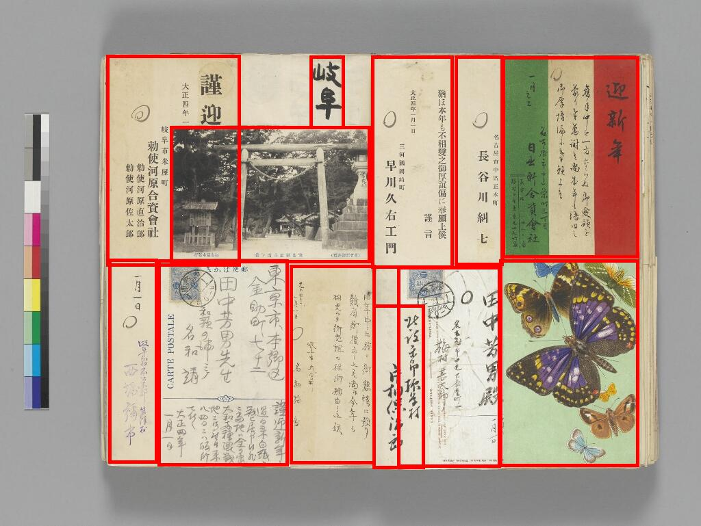

捃拾帖データセット
==================

  

## データセットの概要

捃拾帖データセットは以下のURLから公開しています。 
現在(2022年8月3日)の最新バージョンは1.0です。 

https://drive.google.com/file/d/1SOtsM3WZtATAJsuooxF_LnM3-ojC8n-v/view?usp=sharing （約7GB）

<!-- COCO形式: -->

<!-- - YOLO形式: https://lab.ndl.go.jp/dataset/dataset_kindai.zip -->

1.概要
----

### 1.1 データセットの提供元

捃拾帖データセットは、東京大学総合図書館所蔵「田中芳男・博物学コレクション」&lt;[*https://iiif.dl.itc.u-tokyo.ac.jp/repo/s/tanaka/*](https://iiif.dl.itc.u-tokyo.ac.jp/repo/s/tanaka/)&gt;が提供している資料画像データの中から、「捃拾帖」のアノテーションデータを公開しています。

### 1.2 データセットの内訳

捃拾帖データセット(ver1.0)の内訳は以下のとおりです。

  | 画像数
  |----------
  |12,124画像

### 1.3 データセットの権利
「CC BY」&lt; https://creativecommons.org/licenses/by/4.0/deed.ja &gt;

捃拾帖データセットは、自由な二次利用が可能です。ただし、二次利用に際しては、次の事項へのご配慮をお願いいたします。これらのお願いは法的な契約ではありませんが、できる限りご留意の上でご利用くださるよう、ご協力をお願いします。

- データを編集・加工等して利用する場合は、それを行ったことを記載してください。編集・加工等を、元となる作品・原資料の作者や当館が行なったかのような態様で公表しないようご留意ください。
- 当該データが自由に二次利用可能であることの表記を保持してください。
- 元となる作品や、その作者の名声を傷つける形での利用は行わないようご留意ください。また、元となる作品に関わる文化やコミュニティへの配慮を行ってください。
- 著作権以外の権利（著作者人格権、著作隣接権、肖像権、パブリシティ権、プライバシー権、商標権等）にも留意し、関連法令を遵守してください。
- 論文等に利用する場合には、先行研究や後続研究と比較を容易にするため捃拾帖データセットとバージョンの明記にご協力ください。

2 データセットの説明
------------------

### 2.1 データセットの構成

捃拾帖データセットは以下の2種類を含みます。

(1) 資料画像(jpeg画像)

(2) アノテーションデータ(json形式)

### 2.2 アノテーションデータの形式

COCO形式でレイアウトの矩形情報とラベル名を記述したjsonを提供しています。

#### 予測対象となるレイアウトのラベル

  |No  | ラベル名          |説明
  |----| -----------------| --------------------------------------
  |0   | item       | 貼り込み資料

